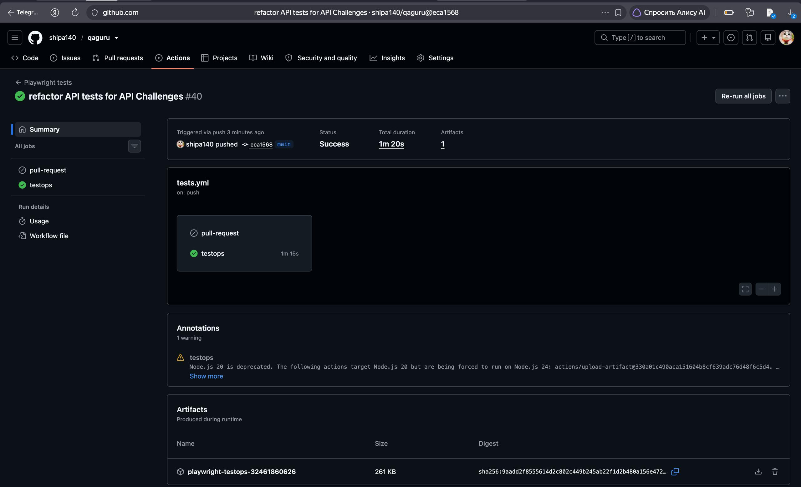
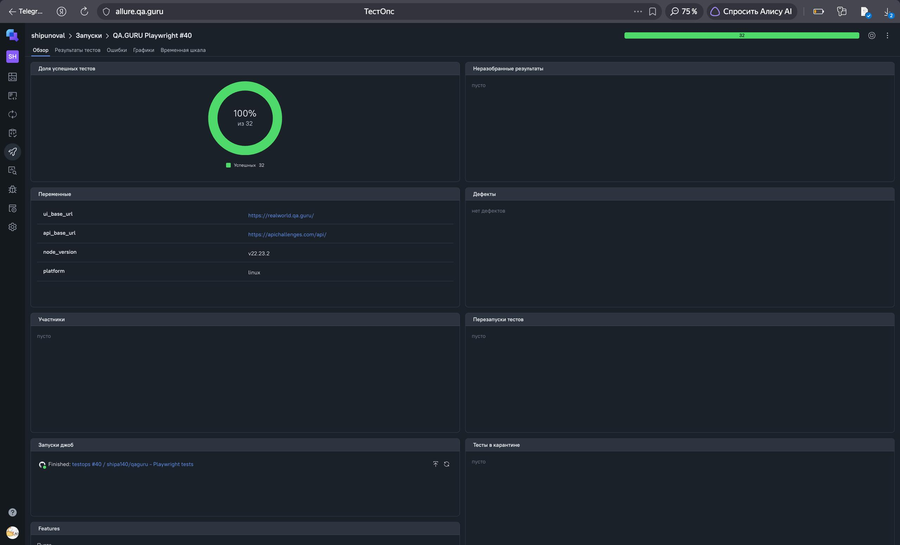
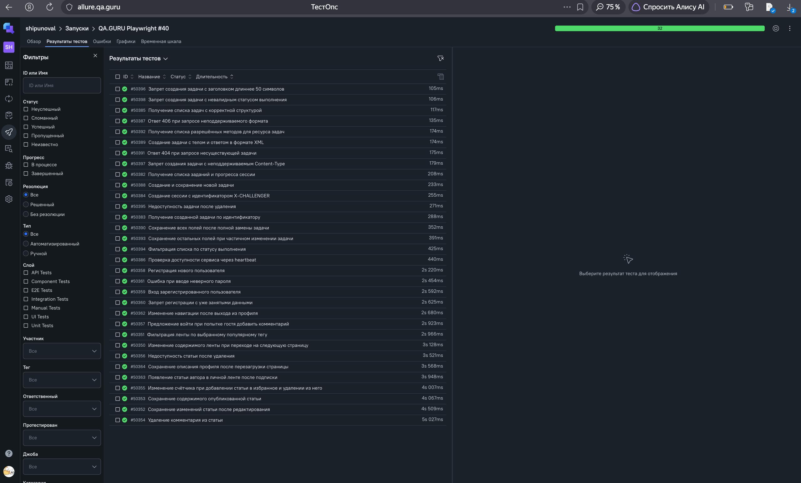
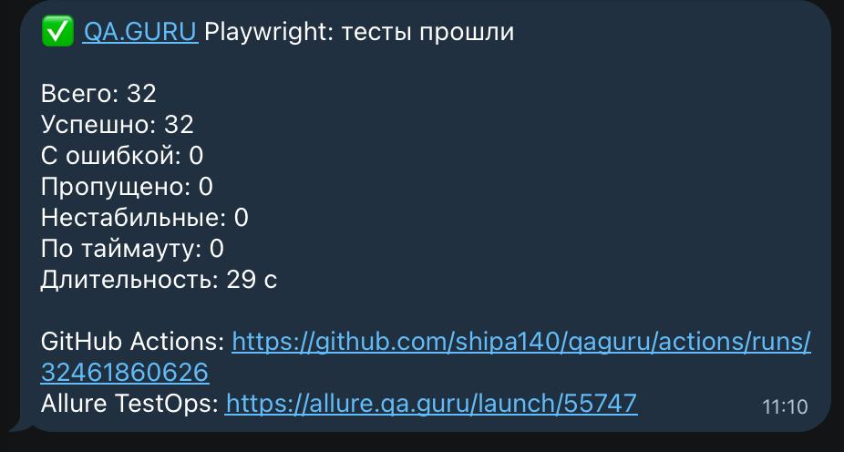

# Дипломный проект QA.GURU: RealWorld UI + API Challenges

[](https://github.com/shipa140/qaguru/actions/workflows/tests.yml)
[](https://playwright.dev/)
[](https://allure.qa.guru/launch/55747)

Масштабируемый Playwright-фреймворк: **15 UI-тестов**
[RealWorld](https://realworld.qa.guru/) и **17 API-тестов**
[API Challenges](https://apichallenges.com/). В проекте настроены GitHub
Actions, Allure TestOps и уведомления в Telegram.

## Покрытие

| Уровень | Проверки                                                                     |
| ------- | ---------------------------------------------------------------------------- |
| UI      | регистрация, вход, профиль, подписки, статьи, комментарии, избранное и ленты |
| API     | сессии, прогресс, CRUD задач, фильтрация, валидация и XML/JSON               |

## Установка и запуск

```bash
npm ci
npx playwright install chromium
cp .env.example .env
npm test
```

Другие команды:

```bash
npm run test:ui       # 15 UI-тестов
npm run test:api      # 17 API-тестов
npm run test:get      # API-тесты с тегом @get
npm run test:post     # API-тесты с тегом @post
npm run test:ui-mode  # интерактивный режим Playwright
npm run test:list     # список тестов без запуска
```

Адреса стендов задаются переменными `UI_BASE_URL` и `API_BASE_URL` в локальном
`.env`, исключённом из Git. В CI токены Allure TestOps и Telegram передаются
через GitHub Secrets.

## Архитектура

```text
src/
├── api/          # Api-фасад и сервисы API Challenges
├── builders/     # тестовые данные; faker используется только здесь
├── fixtures/     # fixtures app, ui и очистка тестовых ресурсов
├── notifications/ # уведомления о результате прогона в Telegram
├── pages/        # Page Objects и UI-фасад App
├── reporters/    # сводка прогона
└── support/      # подготовка данных UI-тестов через RealWorld API
tests/
├── api/
└── ui/
```

- `App` и `Api` создаются только через fixtures `ui` и `app`.
- Тонкий `App` агрегирует Page Objects, а `Api` — ресурсные API-сервисы.
- Fixture `setupApi` подготавливает, проверяет и очищает данные UI-тестов через
  RealWorld API; в тестах API Challenges она не используется.
- Page Objects содержат законченные пользовательские действия для своих страниц.
- Ассерты находятся только в тестах; `waitForTimeout` не используется.
- Экспорты модулей собраны через `index.js`.

Проверка архитектуры и стиля:

```bash
npm run lint
npm run format:check
```

## Результаты

- [GitHub Actions: успешный запуск 32/32](https://github.com/shipa140/qaguru/actions/runs/32465229177)
- [Allure TestOps: запуск №40](https://allure.qa.guru/launch/55747)

### GitHub Actions



### Allure TestOps





### Telegram


